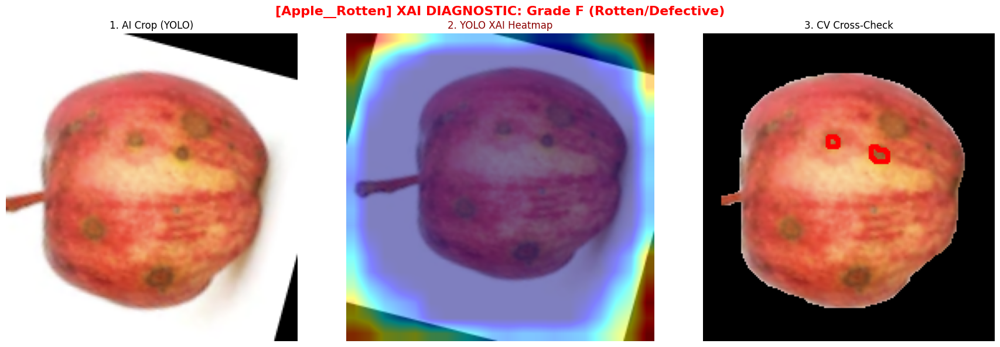
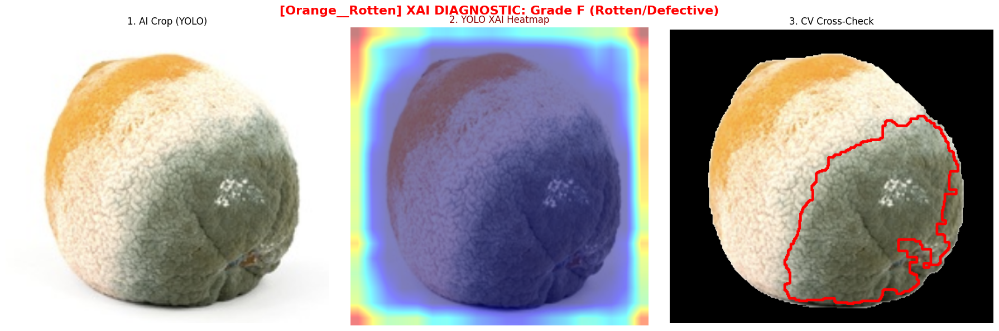
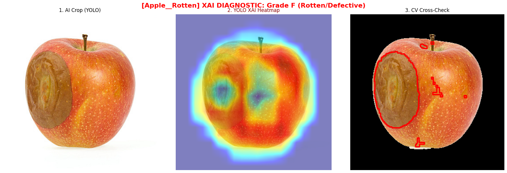
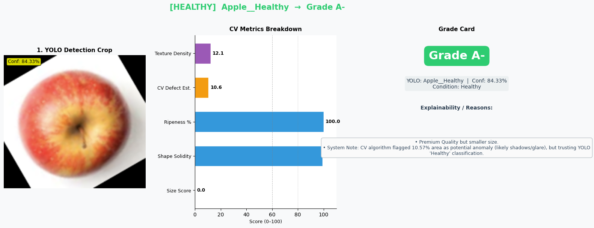

# 🍎 Advanced AI System for Smart Food Marketplace


> A comprehensive AI ecosystem combining a **Hybrid Deep Learning Grading System** (YOLOv10 + OpenCV XAI) with an intelligent **Recommendation Engine** for agricultural marketplaces.

---

## 📑 Table of Contents
1. [Project Overview](#-project-overview)
2. [System Architecture](#-system-architecture)
3. [Repository Structure & Signposting](#-repository-structure--signposting)
4. [Dataset Preparation](#-dataset-preparation)
5. [Installation Guide](#️-installation-guide)
6. [Usage Instructions](#-usage-instructions)
7. [Test Strategy](#-test-strategy)
8. [Code Style & Documentation](#-code-style--documentation)
9. [Roadmap for Future Extension](#-roadmap-for-future-extension)

---

## 📖 Project Overview

This repository contains the core AI components for a Smart Food Marketplace platform:
1. **Computer Vision Grading System**: A robust pipeline that detects fruit, segments the background, analyzes ripeness/defects using OpenCV, and assigns a strict quality grade (A, B, C, F). It includes Explainable AI (EigenCAM) to provide transparent reasoning for its decisions.
2. **Recommendation Engine**: A Collaborative Filtering model designed to suggest relevant agricultural products to buyers based on historical transaction data and user preferences.

---

## 🧠 System Architecture

The core innovation of this project is the **Hybrid Grading Pipeline**, which mitigates the "black-box" nature of pure Deep Learning models by combining them with deterministic Computer Vision logic.

1. **Phase 1 - Object Detection (YOLOv10)**: Fast and accurate localization of the fruit. It classifies the base condition (e.g., `Apple_Healthy`, `Banana_Rotten`).
2. **Phase 2 - Physical Measurement (OpenCV)**: If YOLO detects a "Healthy" fruit, OpenCV takes over to calculate exact physical metrics:
   - **Size Score**: Pixel area min-max scaling using `cv2.contourArea`.
   - **Shape Conformity**: Solidity analysis using Convex Hulls.
   - **Ripeness Percentage**: HSV color space masking against predefined agricultural profiles.
3. **Phase 3 - Explainable AI (EigenCAM)**: If a fruit is flagged as "Rotten", the XAI module generates a heatmap over the original image, showing exactly which visual features triggered the defect classification.

### ⚠️ Note on the CV Cross-check Mechanism
While the system employs a **Hybrid AI + CV** architecture, YOLOv10 acts as the ultimate authority for classification. The traditional Computer Vision (CV) cross-check algorithm (Phase 2) is used purely for extracting precise physical metrics (HSV color masking for ripeness, Canny Edge for texture, Contour Analysis for shape). 

**Limitations:** Traditional CV algorithms are highly sensitive to environmental factors. Suboptimal lighting, specular highlights (glare/flash), or harsh drop shadows can create "phantom defects" that the CV algorithm might mistakenly flag as rot. Therefore, if the CV logic flags an anomaly but YOLO strongly classifies the fruit as "Healthy", the system logs an internal system warning rather than automatically rejecting the fruit. This ensures the robustness of the system in unpredictable real-world lighting conditions.

<p align="center">
  
  <br>
  
  <br>
  
  <br>
  <em>Figure 1: Full diagnostic pipeline showing YOLO Crop, EigenCAM Heatmap, and CV Defect contours.</em>
</p>

---

## 📁 Repository Structure & Signposting

The codebase is strictly modularized following Software Engineering best practices to separate core logic, research, testing, and deployment.

```text
advanced_ai_project/
│
├── grading/                       # [1] HYBRID CV GRADING MODULE
│   ├── src/                       # Core source code
│   │   ├── detection/             # YOLOv10 wrapper classes (detector.py)
│   │   ├── grading/               # OpenCV grading algorithms (grader.py, inference.py)
│   │   └── explainability/        # XAI EigenCAM heatmap generation (explainer.py)
│   ├── tests/                     # Test scripts for grading logic QA (PyTest)
│   └── models/                    # Model weights storage
│
├── recommendation/                # [2] RECOMMENDATION ENGINE MODULE
│   ├── recommendation.ipynb       # Model training and evaluation notebook
│   ├── mock_transactions.json     # Sample transaction dataset
│   └── recommendation.pkl         # Serialized trained recommendation model
│
├── notebooks/                     # [3] R&D, DATA ANALYSIS & DEMOS
│   ├── 01_data_annotation.ipynb   # Automated data download & preparation
│   ├── 02_yolov10_model_training.ipynb # Training pipeline & performance charts
│   ├── 03_xai_visualization.ipynb # Model explainability demo
│   ├── 04_fruit_grading.ipynb     # End-to-end grading visualization
│   └── 05_human_in_the_loop...ipynb # Active learning & monitoring dashboard
│
├── requirements.txt               # Project dependencies
├── pyproject.toml                 # Ruff / Linter configurations
└── viva.txt                       # Detailed technical documentation for Viva Voce
```

---

## 📊 Dataset Preparation

The AI Grading model utilizes a curated fruit disease dataset. To replicate the training environment from scratch:

1. Ensure your Kaggle API credentials (`kaggle.json`) are configured in your user directory (e.g., `~/.kaggle/`).
2. Execute the `notebooks/01_data_annotation.ipynb` notebook.
3. This script will automatically download the dataset, clean the labels, and structure it into the standard YOLO format required for training.

---

## ⚙️ Installation Guide

This project requires **Python 3.10+**. Follow these steps to set up the development environment locally.

### 1. Create a Virtual Environment
It is highly recommended to isolate dependencies using a Python virtual environment:
```bash
# Windows
python -m venv .venv
.venv\Scripts\activate

# macOS/Linux
python3 -m venv .venv
source .venv/bin/activate
```

### 2. Install Dependencies
Install all required libraries, including Ultralytics, OpenCV, PyTorch, and PyTest:
```bash
pip install -r requirements.txt
```

### 3. GPU Acceleration (CUDA) - Optional but Recommended
For faster YOLOv10 inference and model training, install PyTorch with CUDA support (e.g., CUDA 12.4 for NVIDIA RTX GPUs):
```bash
pip install torch torchvision --index-url https://download.pytorch.org/whl/cu124
```
Verify CUDA availability:
```bash
python -c "import torch; print('CUDA Available:', torch.cuda.is_available())"
```

---

## 🚀 Usage Instructions

### 1. Computer Vision Grading Pipeline
To run a quality assessment prediction on a new image, use the provided inference API. You can run this from the python interactive shell or any script at the root directory:

```python
from grading.src.grading.inference import predict

# Run end-to-end inference (Detection + CV Grading + XAI)
# Ensure you have a valid model at grading/models/weights/fruit_disease_v2/weights/best.pt
result = predict("path/to/test_image.jpg")

print(f"Detected: {result['class_name']}")
print(f"Final Grade: {result['grade']}")
print(f"Reasons: {result['xai']['reasons']}")
```

<p align="center">
  
  <br>
  <em>Figure 2: Output of the grading pipeline showing segmented fruit and physical analysis.</em>
</p>

### 2. Recommendation Engine
The recommendation model is serialized as a `.pkl` file. You can retrain it or test recommendations by running the dedicated Jupyter Notebook:
1. Navigate to the `recommendation/` directory.
2. Open `recommendation.ipynb`.
3. Run the cells to load `mock_transactions.json`, train the Collaborative Filtering model, and output user-specific product suggestions based on historical data.

---

## 🧪 Test Strategy

Software reliability is guaranteed through automated unit testing. We use `pytest` to validate the OpenCV physical metrics calculation (size scaling, shape conformity) and ensure the logic boundary conditions are strictly met without regressions.

**To execute the test suite:**
```bash
# Ensure you are at the project root directory
pytest
```
*The test runner is configured via `pyproject.toml` to automatically discover and execute all unit tests within the `grading/tests/` directory.*

---

## 🧹 Code Style & Documentation

This codebase strictly adheres to **PEP8** standards to ensure clean, readable, and maintainable Python code for collaborative environments.

* **Linting & Formatting:** We utilize [Ruff](https://docs.astral.sh/ruff/) to automatically format code and check for style violations.
* **Documentation:** All core classes and major functions (`grader.py`, `detector.py`, `inference.py`) feature comprehensive **Google-style docstrings**. Internal complex logic (like GrabCut background removal and contour filtering) is heavily commented to explain the *business intent* behind the algorithms.

To verify code quality locally:
```bash
ruff check grading/src/
ruff format --check grading/src/
```

---

## 🌟 Roadmap for Future Extension

To evolve this project into a production-ready enterprise system, we have planned the following enhancements:

1. **CI/CD Pipeline Integration**: Implement GitHub Actions to automatically run `pytest` and `ruff` linting on every pull request, ensuring code quality before merging to the `main` branch.
2. **Geographical Data Expansion**: Expand the YOLO training dataset to include local agricultural variants specific to the Bristol/UK region, improving model resilience against local lighting and soil conditions.
3. **Human-in-the-loop (Active Learning)**: Deploy the monitoring dashboard (prototyped in `notebooks/05_human_in_the_loop_monitoring.ipynb`) as a web admin panel. This will capture user override data (when farmers disagree with the AI grade) to create a continuous data flywheel for model retraining and drift mitigation.
